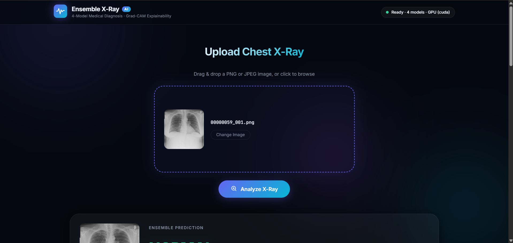
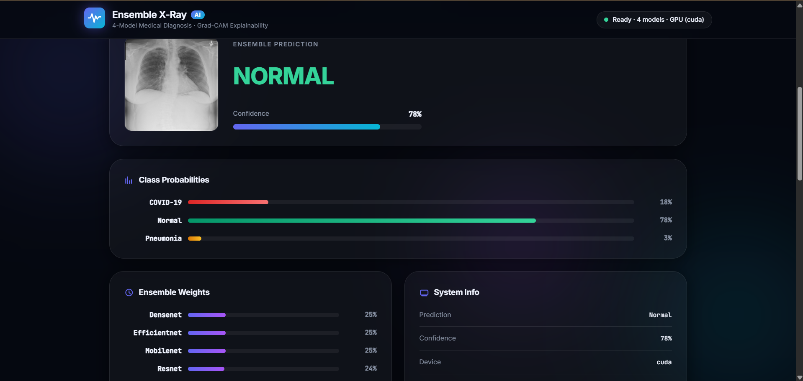
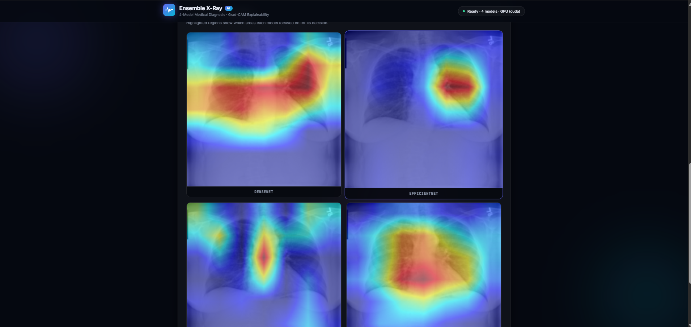
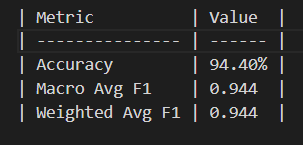
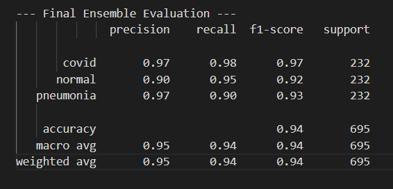
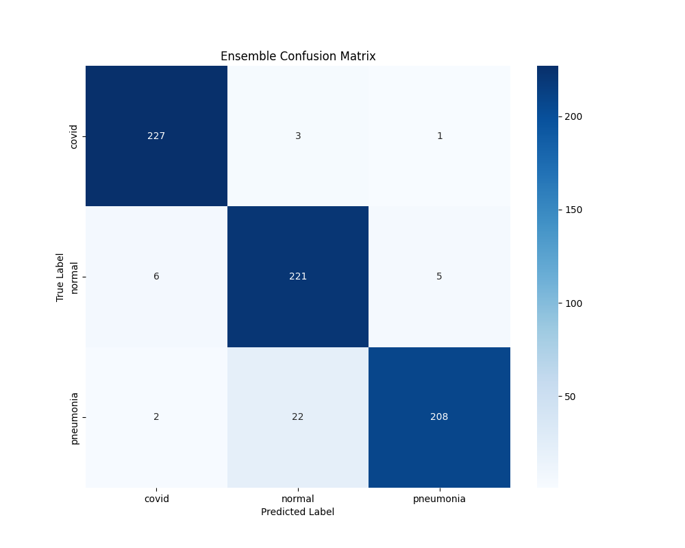

<div align="center">

# 🩺 Ensemble X-Ray — Chest X-Ray AI Classifier

**Automated chest X-ray classification powered by a 4-model deep learning ensemble**  
*COVID-19 · Pneumonia · Normal*

[](https://python.org)
[](https://pytorch.org)
[](https://flask.palletsprojects.com)
[](https://developer.nvidia.com/cuda-toolkit)
[](LICENSE)

</div>

---

## 📌 Overview

Ensemble X-Ray is a **production-grade medical image classification system** that combines four state-of-the-art CNN architectures into a single weighted ensemble. The system classifies chest X-ray images into three categories — **COVID-19**, **Pneumonia**, and **Normal** — and provides visual explainability via **Grad-CAM heatmaps**.

### Why Ensemble Learning?

Single-model classifiers on medical X-rays suffer from:
- High variance and overfitting on small datasets
- Lack of confidence calibration
- No explainability (black-box predictions)

This system addresses all three by:
- **Accuracy-weighted softmax fusion** across 4 diverse architectures
- **Bootstrap bagging** for training diversity
- **Grad-CAM** for per-model visual explainability
- **Flask web interface** for interactive clinical-style inference

---

## 🌐 Web Interface

A complete interactive web application is included. Upload any chest X-ray and get:
- Ensemble prediction with confidence score
- Per-class probability breakdown
- Grad-CAM heatmaps from all 4 models

| Upload X-Ray | View Prediction | Grad-CAM Heatmaps |
|:---:|:---:|:---:|
|  |  |  |

---

## 🧠 Model Architecture

| Model | Backbone | Parameters | Target Layer (Grad-CAM) |
|-------|----------|-----------|------------------------|
| ResNet-18 | Residual Network | ~11M | `layer4` |
| MobileNetV3-Small | Inverted Residuals | ~2.5M | `features[-1]` |
| EfficientNet-B0 | Compound Scaling | ~5.3M | `features[-1]` |
| DenseNet-121 | Dense Connections | ~8M | `features.denseblock4` |

All models use **ImageNet pretrained weights** with frozen backbones; only the classification head is fine-tuned. This prevents overfitting on the limited medical dataset.

### Ensemble Strategy

```
Image → [ResNet] → softmax → × w₁ ─┐
        [MobileNet] → softmax → × w₂ ─┤→ Σ → argmax → Prediction
        [EfficientNet] → softmax → × w₃ ─┤
        [DenseNet] → softmax → × w₄ ─┘

where wᵢ = val_accuracyᵢ / Σ val_accuracyⱼ   (computed on held-out split)
```

Weights are computed on a **held-out 30% validation split** (separate from the training validation split) to prevent data leakage.

---

## 📊 Results

| Metric | Score |
|--------|-------|
| Ensemble Accuracy | See `outputs/metrics/` after training |
| Macro AUC-ROC | See `outputs/metrics/` after training |
| Confusion Matrix | `outputs/metrics/confusion_matrix.png` |

**Sample evaluation outputs:**

| Accuracy | Classification Report | Confusion Matrix |
|:---:|:---:|:---:|
|  |  |  |

---

## 📂 Project Structure

```
Ensemble_xray1/
│
├── 📄 main.py                  # Training pipeline (entry point)
├── 📄 inference.py             # Inference engine (model loading + prediction + Grad-CAM)
├── 📄 app.py                   # Flask web server (routes: /, /predict, /status)
├── 📄 generate_results.py      # Standalone evaluation on saved models
├── 📄 requirements.txt         # Python dependencies
│
├── 📁 utils/                   # Modular ML utilities
│   ├── __init__.py
│   ├── dataset.py              # XRayDataset (PyTorch Dataset class)
│   ├── transforms.py           # Train & val image transforms (medical-specific augmentation)
│   ├── bagging.py              # Bootstrap sampling for training diversity
│   ├── train.py                # Single-model training loop (Adam + LR scheduler)
│   ├── evaluate.py             # Ensemble evaluation (AUC-ROC, confusion matrix)
│   ├── gradcam.py              # Grad-CAM heatmap generation (pytorch-grad-cam)
│   ├── save.py                 # Model/metrics/predictions persistence
│   └── run_gradcam.py          # Standalone Grad-CAM runner
│
├── 📁 templates/
│   └── index.html              # Single-page web app UI
│
├── 📁 static/
│   ├── style.css               # Web app styles
│   ├── app.js                  # Frontend logic (drag-and-drop, fetch API)
│   ├── uploads/                # Runtime: uploaded images (gitignored)
│   └── gradcam/                # Runtime: generated heatmaps (gitignored)
│
├── 📁 data/                    # Dataset directory (not included — see Dataset Setup)
│   ├── train/
│   ├── val/
│   └── test/
│
├── 📁 outputs/                 # Generated after training (gitignored)
│   ├── models/                 # Saved .pth weight files
│   ├── logs/                   # Training logs per epoch
│   ├── metrics/                # JSON reports + confusion matrix PNG
│   ├── predictions/            # CSV prediction outputs
│   └── gradcam/                # Batch Grad-CAM outputs
│
└── 📁 docs/
    ├── gantt_chart.png         # Project timeline
    └── screenshots/            # Web app & result screenshots
```

---

## ⚙️ Setup & Installation

### 1. Clone the Repository

```bash
git clone https://github.com/AnshKene/medical-xray-ensemble.git
cd medical-xray-ensemble
```

### 2. Create Virtual Environment

```bash
python -m venv myenv

# Windows
myenv\Scripts\activate

# macOS / Linux
source myenv/bin/activate
```

### 3. Install Dependencies

```bash
pip install -r requirements.txt
```

> **GPU (recommended):** The `requirements.txt` includes `torch==2.6.0+cu124` for CUDA 12.4.
> For CPU-only or different CUDA versions, install PyTorch separately from [pytorch.org](https://pytorch.org/get-started/locally/).

---

## 📁 Dataset Setup

The dataset is **not included** in this repository (privacy + size). Organize your chest X-ray images in the following structure:

```
data/
├── train/
│   ├── covid/        # COVID-19 X-rays
│   ├── normal/       # Healthy X-rays
│   └── pneumonia/    # Pneumonia X-rays
├── val/
│   ├── covid/
│   ├── normal/
│   └── pneumonia/
└── test/
    ├── covid/
    ├── normal/
    └── pneumonia/
```

**Recommended Dataset:** [COVID-19 Chest X-ray Dataset on Kaggle](https://www.kaggle.com/datasets/pranavraikokte/covid19-image-dataset)
*(~1,125 images, 3 classes, pre-split)*

---

## ▶️ Usage

### Step 1: Train the Ensemble

```bash
python main.py
```

This will:
1. Load data from `data/train`, `data/val`, `data/test`
2. Train 4 models with bootstrap bagging (15 epochs each)
3. Compute accuracy-weighted ensemble weights on held-out validation split
4. Evaluate the ensemble on the test set
5. Save models → `outputs/models/`
6. Save metrics → `outputs/metrics/`
7. Save predictions → `outputs/predictions/`

### Step 2: Generate Evaluation Results (Optional)

Re-run evaluation on already-trained models without retraining:

```bash
python generate_results.py
```

### Step 3: Launch the Web Interface

```bash
python app.py
```

Open your browser at **[http://localhost:5000](http://localhost:5000)**

> Models are loaded lazily on the first `/predict` request and cached in memory.
> Check `/status` endpoint to verify model readiness before the first prediction.

---

## 🔬 Technical Design Decisions

| Decision | Rationale |
|----------|-----------|
| **Frozen backbone** | Prevents overfitting on small medical datasets (~1K images) |
| **Label smoothing (0.1)** | Reduces overconfidence; improves calibration |
| **Bootstrap bagging** | Creates diverse training subsets per model |
| **ReduceLROnPlateau** | Automatically halves LR when validation accuracy plateaus |
| **Val split for ensemble weights** | Held-out 30% of val data prevents data leakage in weight computation |
| **`deepcopy` for best weights** | Correct snapshot of best epoch (not a live reference) |
| **`num_workers=0`** | Avoids Windows multiprocessing spawn issues |
| **Grad-CAM hook fix** | Temporarily unfreezes target layer params so gradient hooks fire correctly on frozen models |

---

## 🔑 Key Features

- ✅ **4-Model Weighted Ensemble** — ResNet-18, MobileNetV3, EfficientNet-B0, DenseNet-121
- ✅ **Bootstrap Bagging** — diverse training per model
- ✅ **Grad-CAM Explainability** — visual heatmaps for all 4 models simultaneously
- ✅ **Flask Web App** — drag-and-drop upload, real-time prediction
- ✅ **AUC-ROC Evaluation** — critical metric for medical AI
- ✅ **Reproducible** — fixed seeds, deterministic CUDA ops
- ✅ **Modular Codebase** — each `utils/` module has a single responsibility

---

## 👨‍💻 Contributors

| Name | Role |
|------|------|
| **Ansh Kene** | ML Pipeline, Web Interface, Grad-CAM |
| **Vyas Thakre** | Model Architecture, Evaluation |

---

## 📜 License

This project is for **academic and research purposes only**.  
Not intended for clinical diagnosis or medical decision-making.

---

<div align="center">
<sub>Built with PyTorch · Flask · pytorch-grad-cam</sub>
</div>
